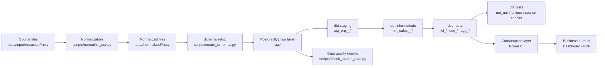

# Northwind Analytics

Analytics engineering project for the Northwind Traders case study.

The project builds an analytical layer on top of the Northwind source data to support business reporting, performance analysis, average ticket improvement, and churn monitoring.

## Objective

Create a reliable analytics pipeline that:

- ingests Northwind CSV source files into PostgreSQL
- transforms raw operational data into analytical models with dbt
- exposes facts, dimensions, and aggregated marts for reporting
- supports dashboarding in Power BI

## Stack

- PostgreSQL
- dbt
- Python
- Power BI
- Docker Compose

## Data Pipeline



## Project Structure

```text
northwind-analytics/
|-- data/
|   |-- input/extracted/       # raw Northwind CSV files
|   `-- normalized/            # normalized CSV files ready for ingestion
|-- dbt/                       # dbt project: staging, intermediate, marts, tests
|-- docs/                      # runbook and data dictionary
|-- notebooks/                 # exploratory and metric validation notebooks
|-- powerbi/                   # Power BI dashboard files
|-- scripts/                   # ingestion and validation scripts
|-- docker-compose.yml         # PostgreSQL service
`-- README.md
```

## Analytical Layers

### Raw

The `raw` schema stores the source tables loaded from normalized CSV files with minimal transformation.

Examples:

- `raw.orders`
- `raw.order_details`
- `raw.customers`
- `raw.products`

### Staging

The staging layer standardizes source fields and prepares clean, typed datasets for downstream transformation.

Examples:

- `stg_erp__orders`
- `stg_erp__order_details`
- `stg_erp__customers`
- `stg_erp__products`

### Intermediate

The intermediate layer applies business logic and enriches transactional data before mart-level modeling.

Examples:

- `int_sales__order_lines`
- `int_sales__orders_enriched`

### Marts

The marts layer contains the final analytical tables used by reporting and dashboards.

Fact models:

- `fct_orders`
- `fct_order_lines`

Dimension models:

- `dim_customers`
- `dim_products`
- `dim_employees`
- `dim_shippers`

Aggregated models:

- `agg_sales_monthly`
- `agg_sales_by_product`
- `agg_sales_by_category`
- `agg_customer_behavior`
- `agg_customer_churn_risk`
- `agg_shipping_performance`

## Documentation

Project documentation available in `docs/`:

- `docs/runbook.md`: operational step-by-step execution guide
- `docs/data_dictionary.md`: dataset, grain, and metric definitions

## Operational Guide

For the full execution flow, environment setup, ingestion steps, dbt execution, validation process, and dashboard refresh instructions, see `docs/runbook.md`.

## Main Deliverables

- analytical layer in dbt
- documented metrics and model definitions
- executive dashboard in Power BI
- final reporting outputs based on the analytical schema
